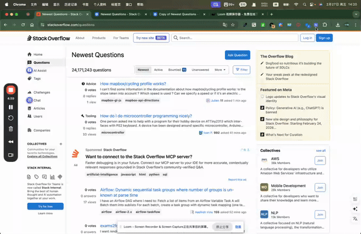

<!--
 * Element Hider (元素隐藏器)
 * 浏览器扩展 - 隐藏/显示 DOM 元素
 * 
 * Languages: English | 中文
-->
---

## Demo

<div align="center">
  
</div>

---
## Element Hider

[English](#english) · [中文](#中文)
A browser extension that allows you to hide/show DOM elements with right-click context menu or interactive selection.

一款浏览器扩展，支持通过右键菜单或交互式选择来隐藏/显示 DOM 元素。

---

<!-- START English -->

## English

### Features

- Hide/Show elements via right-click context menu
- Interactive element selection to hide
- Persistent rule storage
- Bilingual support (Chinese & English)
- Rule management (view, toggle, delete)

### Installation

#### Chrome / Edge / Brave

1. Open `chrome://extensions` in your browser
2. Enable **Developer mode** in the top right corner
3. Click **Load unpacked**
4. Select the `hide-ele` folder

#### Firefox

1. Open `about:debugging#/runtime/this-firefox`
2. Click **Load Temporary Add-on...**
3. Select any file in the `hide-ele` folder (e.g., `manifest.json`)

### Usage

#### 1. Hide Element via Context Menu

1. Right-click on any element you want to hide
2. Select **"Hide this element"** from the context menu
3. The element will be hidden (using `visibility: hidden` to preserve layout)

#### 2. Interactive Element Selection

1. Click the extension icon in the browser toolbar
2. Click **"Select Element to Hide"** button
3. The page enters selection mode, hover over elements to preview
4. Click on any element to hide it
5. Press <kbd>Esc</kbd> to cancel

#### 3. Show Hidden Elements

1. Right-click on any hidden element
2. Select **"Show this element"** from the context menu
3. The element will become visible again

#### 4. Rule Management

1. Click the extension icon in the browser toolbar
2. View all saved rules in the popup
3. Toggle rules on/off with the switch button
4. Delete individual rules with the delete button
5. Click "Clear All" to remove all rules

#### 5. Change Language

1. Click the extension icon
2. Select your preferred language from the dropdown
3. The interface will update immediately


### Data Structure

Rules are stored in browser storage with the following structure:

```json
{
  "rules": [
    {
      "selector": "#header",
      "url": "https://example.com",
      "isHidden": true,
      "isEnabled": true,
      "createdAt": 1234567890
    }
  ],
  "language": "en"
}
```

### Permissions

| Permission | Purpose |
|---|---|
| `contextMenus` | Right-click context menu |
| `storage` | Save rules and settings |
| `activeTab` | Access current tab |
| `scripting` | Execute content scripts |

### Tech Stack

- **Manifest V3** - Chrome Extension
- **Vanilla JavaScript** - No framework dependencies
- **CSS3** - Modern styling

### License

MIT

---

<!-- END English -->

---

<!-- START 中文 -->

## 中文

### 功能特点

- 右键菜单隐藏/显示元素
- 交互式选择要隐藏的元素
- 规则持久化保存
- 中英文双语支持
- 规则管理（查看、开关、删除）

### 安装说明

#### Chrome / Edge / Brave

1. 打开浏览器扩展管理页面 `chrome://extensions`
2. 启用右上角的「**开发者模式**」
3. 点击「**加载已解压的扩展程序**」
4. 选择 `hide-ele` 文件夹

#### Firefox

1. 打开 `about:debugging#/runtime/this-firefox`
2. 点击「**加载临时附加组件**」...
3. 选择 `hide-ele` 文件夹中的任意文件（如 `manifest.json`）

### 使用方法

#### 1. 右键菜单隐藏元素

1. 在任意元素上**右键点击**
2. 选择菜单中的「**隐藏这个元素**」
3. 元素将被隐藏（使用 `visibility: hidden` 保持页面布局）

#### 2. 交互式选择隐藏元素

1. 点击浏览器工具栏的**扩展图标**
2. 点击「**选择要隐藏的元素**」按钮
3. 页面进入选择模式，悬停预览要隐藏的元素
4. 点击任意元素即可隐藏
5. 按 <kbd>Esc</kbd> 键取消操作

#### 3. 显示已隐藏的元素

1. 在已隐藏的元素上**右键点击**
2. 选择菜单中的「**显示这个元素**」
3. 元素将重新显示

#### 4. 规则管理

1. 点击浏览器工具栏的**扩展图标**
2. 在弹窗中查看所有已保存的规则
3. 点击**开关按钮**启用/禁用规则
4. 点击**删除按钮**删除单条规则
5. 点击「**清除全部**」删除所有规则

#### 5. 切换语言

1. 点击扩展图标
2. 从下拉菜单选择语言
3. 界面将立即更新


### 数据结构

规则以以下结构存储在浏览器存储中：

```json
{
  "rules": [
    {
      "selector": "#header",
      "url": "https://example.com",
      "isHidden": true,
      "isEnabled": true,
      "createdAt": 1234567890
    }
  ],
  "language": "zh_CN"
}
```

### 权限说明

| 权限 | 用途 |
|---|---|
| `contextMenus` | 右键菜单功能 |
| `storage` | 保存规则和设置 |
| `activeTab` | 访问当前标签页 |
| `scripting` | 执行内容脚本 |

### 技术栈

- **Manifest V3** - Chrome 扩展
- **原生 JavaScript** - 无框架依赖
- **CSS3** - 现代样式

### 许可证

MIT

---

<!-- END 中文 -->

---

<div align="center">

*翻译: [English](#english) · [中文](#中文)*

</div>
